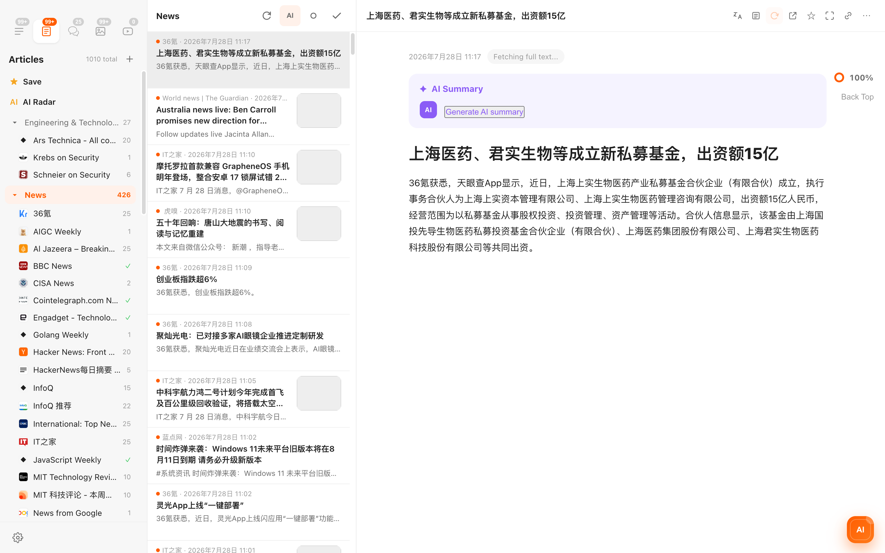
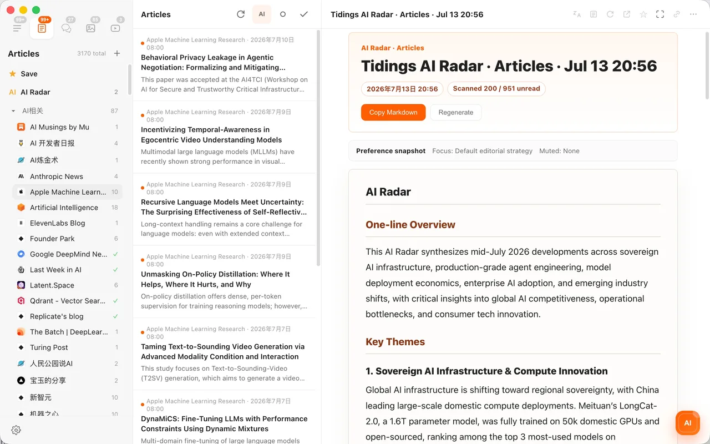
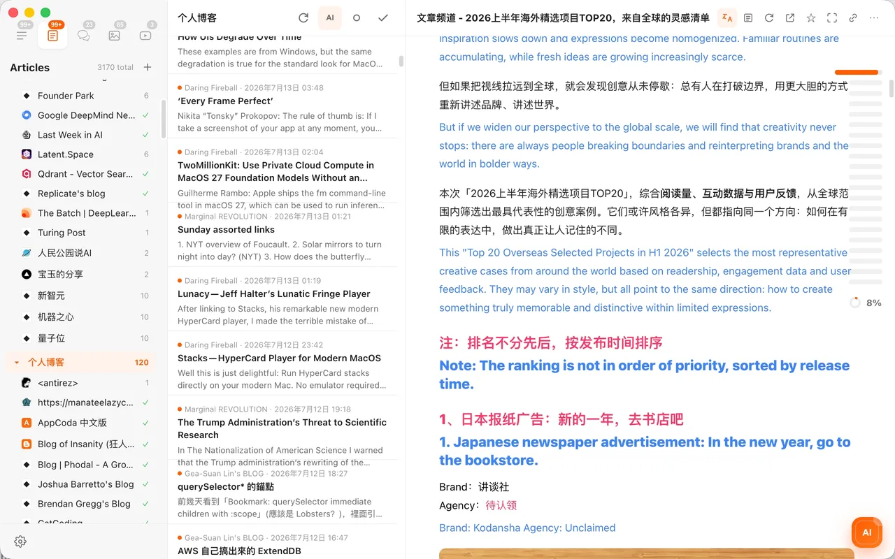

<div align="center">
  
  <h1>Tidings RSS</h1>
  <p><strong>Feeds worth following, verified by a real reader.</strong></p>
  <p>Open, categorized OPML collections for AI, news, research, blogs, videos, podcasts, and engineering.</p>
  <p>
    <a href="README.zh-CN.md">简体中文</a> ·
    <a href="#download">Download</a> ·
    <a href="CONTRIBUTING.md">Contribute</a> ·
    <a href="https://tidings.info/">Tidings</a>
  </p>
  <p>
    <a href="https://github.com/fuxiaoai/tidings-rss/actions/workflows/validate.yml"></a>
    <a href="https://github.com/fuxiaoai/tidings-rss/releases/latest"></a>
    <a href="LICENSE"></a>
  </p>
</div>

This repository is deliberately reader-agnostic. Every file is standard OPML and can be imported into Tidings, NetNewsWire, Reeder, Feedly, Inoreader, FreshRSS, Miniflux, and other compatible readers. It catalogs public endpoints; it does not republish article bodies.

## Download

Release links below are real attachment downloads. The focused bundles overlap by design; `tidings-all.opml` contains each normalized feed only once.

| Collection | Feeds | Download | Browse |
| --- | ---: | --- | --- |
| Complete collection | `627` | [Download `tidings-all.opml`](https://github.com/fuxiaoai/tidings-rss/releases/latest/download/tidings-all.opml) | [View](opml/tidings-all.opml) |
| Artificial intelligence | `74` | [Download `tidings-ai.opml`](https://github.com/fuxiaoai/tidings-rss/releases/latest/download/tidings-ai.opml) | [View](opml/tidings-ai.opml) |
| Blogs & essays | `374` | [Download `tidings-blogs.opml`](https://github.com/fuxiaoai/tidings-rss/releases/latest/download/tidings-blogs.opml) | [View](opml/tidings-blogs.opml) |
| Video channels | `93` | [Download `tidings-videos.opml`](https://github.com/fuxiaoai/tidings-rss/releases/latest/download/tidings-videos.opml) | [View](opml/tidings-videos.opml) |
| Podcasts | `86` | [Download `tidings-podcasts.opml`](https://github.com/fuxiaoai/tidings-rss/releases/latest/download/tidings-podcasts.opml) | [View](opml/tidings-podcasts.opml) |
| Fresh news | `44` | [Download `tidings-news.opml`](https://github.com/fuxiaoai/tidings-rss/releases/latest/download/tidings-news.opml) | [View](opml/tidings-news.opml) |
| Research & science | `28` | [Download `tidings-research.opml`](https://github.com/fuxiaoai/tidings-rss/releases/latest/download/tidings-research.opml) | [View](opml/tidings-research.opml) |
| Chinese sources | `239` | [Download `tidings-chinese.opml`](https://github.com/fuxiaoai/tidings-rss/releases/latest/download/tidings-chinese.opml) | [View](opml/tidings-chinese.opml) |
| Engineering & technology | `186` | [Download `tidings-engineering.opml`](https://github.com/fuxiaoai/tidings-rss/releases/latest/download/tidings-engineering.opml) | [View](opml/tidings-engineering.opml) |

[Download SHA-256 checksums](https://github.com/fuxiaoai/tidings-rss/releases/latest/download/SHA256SUMS.txt) · [Catalog summary](reports/catalog-summary.md) · [Machine-readable catalog](data/feeds.json)

> Tidings Free supports up to 150 feeds. The AI, Video, Podcast, News, and Research bundles each fit that limit; the larger collections are intended for Tidings Pro or readers without a feed cap.

## Verified, not merely collected

The 2026-07-28 catalog was built from 884 normalized candidates and passed through the same production parser used by Tidings.

1. Public catalogs and publisher-owned feeds supplied discovery candidates.
2. URLs were normalized before exact deduplication.
3. Tidings fetched and parsed each endpoint as RSS, Atom, or JSON Feed.
4. A source was accepted only if parsing succeeded and returned at least one item.
5. Dated sources inactive for more than two years were removed.
6. The News bundle applies a 21-day freshness threshold.
7. Live feed metadata was used to rebuild titles, websites, categories, and bundles.
8. Persistent failures found during the real News and Research OPML import were removed from every bundle.

The result is a dated, reproducible quality check—not a promise that a publisher or third-party bridge will stay online forever. See the [validation summary](reports/validation-summary.json), [source boundaries](SOURCES.md), and weekly workflow for the exact evidence.

## Real import preview

The screenshot below is not a mockup. [`tools/capture_tidings_import.cjs`](tools/capture_tidings_import.cjs) launched Tidings with an isolated temporary profile, imported the published News and Research OPML files through the production import path, refreshed them, and captured the resulting application window.



[Read the import verification record](reports/import-verification.json)

To import a collection into Tidings:

1. Download an OPML file above.
2. Open **Settings → Feeds → Import OPML**.
3. Select the file. Tidings preserves the included categories and starts refreshing the feeds.

## Contributing

Good feeds disappear when directories become write-only archives. This project is designed for small, reviewable pull requests:

- suggest a public RSS, Atom, or JSON Feed;
- explain why it is worth following;
- choose the closest category and bundle;
- verify that it currently contains at least one item;
- regenerate OPML and run the dependency-free checks.

Start with [CONTRIBUTING.md](CONTRIBUTING.md) or the **Feed suggestion** issue template. The catalog and original metadata in this repository are dedicated to the public domain under CC0-1.0; publishers retain all rights to their names and feed content.

```bash
python scripts/catalog.py generate
python scripts/catalog.py check
python -m unittest discover -s tests -v
```

[CC0-1.0 license](LICENSE) · [Notices](NOTICE.md) · [Changelog](CHANGELOG.md)

## About Tidings

**Official website: [https://tidings.info](https://tidings.info/)**

Tidings is an AI-native RSS reader for macOS built around a simple promise: get back to reading. Every feed published here passed Tidings' real parser, and the focused OPML bundles are structured for direct import.

The core reading workflow is free: up to 150 RSS, Atom, or JSON Feed subscriptions, OPML import/export, categories, search, favorites, immersive reading, and PDF export. Tidings Pro adds AI Radar, article summaries, article Q&A, bilingual translation, larger libraries, Markdown/Obsidian export, and iCloud features.

Tidings also includes dedicated image and video views, YouTube and Bilibili playback support, enhanced V2EX and Linux.do reply threads, optimized local indexing, bounded concurrent refresh, and per-host request limits for responsive large libraries. Feed-specific enhancements degrade gracefully when an upstream site or bridge is unavailable.

Visit the official website for current Mac App Store availability.

<table>
  <tr>
    <td width="50%"><br><sub>AI Radar connects related developments back to their source articles.</sub></td>
    <td width="50%"><br><sub>Bilingual reading keeps the original and translation together.</sub></td>
  </tr>
  <tr>
    <td width="50%"><br><sub>Dedicated video feeds for sources such as YouTube and Bilibili.</sub></td>
    <td width="50%"><br><sub>Forum-aware reading with threaded replies for supported communities.</sub></td>
  </tr>
</table>

---

If this catalog saves you time, star the repository, share a focused OPML with someone who still loves the open web, and contribute the one feed you would hate to lose.
