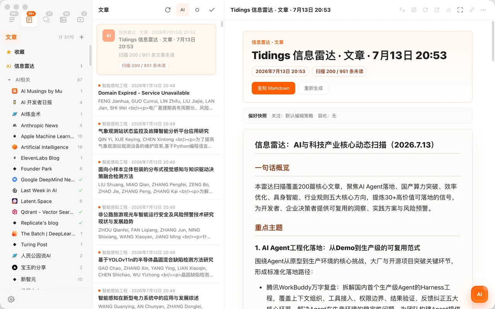
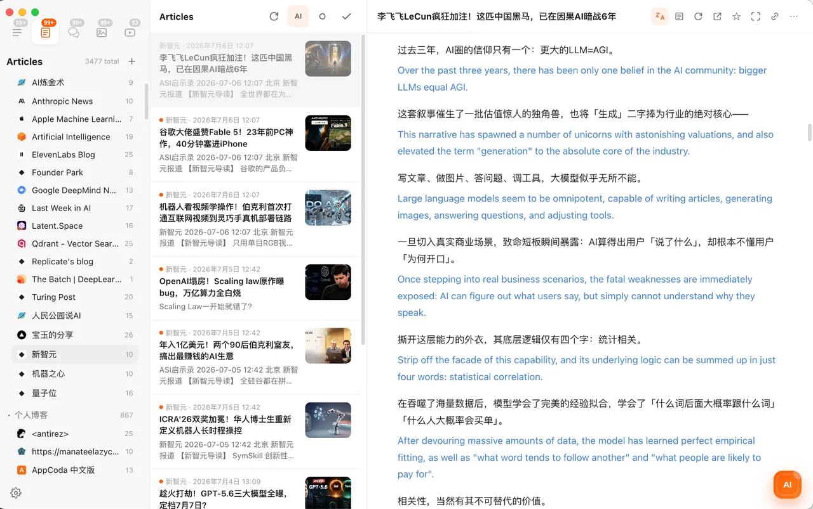

<div align="center">
  
  <h1>Tidings RSS</h1>
  <p><strong>真正值得订阅，并经过真实阅读器验证的 RSS 源。</strong></p>
  <p>开放分享的 AI、新闻、科研、博客、视频、播客和工程技术 OPML 合集。</p>
  <p>
    <a href="README.md">English</a> ·
    <a href="#直接下载">直接下载</a> ·
    <a href="CONTRIBUTING.zh-CN.md">参与贡献</a> ·
    <a href="https://tidings.info/">Tidings</a>
  </p>
  <p>
    <a href="https://github.com/fuxiaoai/tidings-rss/actions/workflows/validate.yml"></a>
    <a href="https://github.com/fuxiaoai/tidings-rss/releases/latest"></a>
    <a href="LICENSE"></a>
  </p>
</div>

本项目不绑定特定阅读器。所有文件均为标准 OPML，可以导入 Tidings、NetNewsWire、Reeder、Feedly、Inoreader、FreshRSS、Miniflux 等兼容阅读器。项目只整理公开订阅端点，不转载文章正文。

## 直接下载

下表链接是 GitHub Release 的真实附件下载。各主题包会有意重叠；`tidings-all.opml` 中每个规范化订阅地址只保留一次。

| 合集 | 数量 | 下载 | 在线查看 |
| --- | ---: | --- | --- |
| 综合全集 | `627` | [下载 `tidings-all.opml`](https://github.com/fuxiaoai/tidings-rss/releases/latest/download/tidings-all.opml) | [查看](opml/tidings-all.opml) |
| AI / 人工智能 | `74` | [下载 `tidings-ai.opml`](https://github.com/fuxiaoai/tidings-rss/releases/latest/download/tidings-ai.opml) | [查看](opml/tidings-ai.opml) |
| 博客与深度文章 | `374` | [下载 `tidings-blogs.opml`](https://github.com/fuxiaoai/tidings-rss/releases/latest/download/tidings-blogs.opml) | [查看](opml/tidings-blogs.opml) |
| 视频频道 | `93` | [下载 `tidings-videos.opml`](https://github.com/fuxiaoai/tidings-rss/releases/latest/download/tidings-videos.opml) | [查看](opml/tidings-videos.opml) |
| 播客 | `86` | [下载 `tidings-podcasts.opml`](https://github.com/fuxiaoai/tidings-rss/releases/latest/download/tidings-podcasts.opml) | [查看](opml/tidings-podcasts.opml) |
| 最新新闻 | `44` | [下载 `tidings-news.opml`](https://github.com/fuxiaoai/tidings-rss/releases/latest/download/tidings-news.opml) | [查看](opml/tidings-news.opml) |
| 科研与科学 | `28` | [下载 `tidings-research.opml`](https://github.com/fuxiaoai/tidings-rss/releases/latest/download/tidings-research.opml) | [查看](opml/tidings-research.opml) |
| 中文订阅源 | `239` | [下载 `tidings-chinese.opml`](https://github.com/fuxiaoai/tidings-rss/releases/latest/download/tidings-chinese.opml) | [查看](opml/tidings-chinese.opml) |
| 工程与技术 | `186` | [下载 `tidings-engineering.opml`](https://github.com/fuxiaoai/tidings-rss/releases/latest/download/tidings-engineering.opml) | [查看](opml/tidings-engineering.opml) |

[下载 SHA-256 校验文件](https://github.com/fuxiaoai/tidings-rss/releases/latest/download/SHA256SUMS.txt) · [目录统计](reports/catalog-summary.md) · [机器可读目录](data/feeds.json)

> Tidings 免费版最多支持 150 个订阅源。AI、视频、播客、新闻和科研包都在该限制内；更大的合集适合 Tidings Pro 或没有订阅数量限制的阅读器。

## 不是收集完就结束

2026-07-28 版本从 884 个规范化候选源开始，全部经过 Tidings 正式解析链路复核：

1. 从公开目录和发布者官方 Feed 中提取候选地址；
2. 先规范化 URL，再做精确去重；
3. 使用 Tidings 实际抓取并解析 RSS、Atom 或 JSON Feed；
4. 只有解析成功且至少返回一篇内容的源才能入选；
5. 有明确日期且超过两年未更新的源会被淘汰；
6. 最新新闻包额外要求最近内容不早于 21 天；
7. 使用在线 Feed 自身的标题和站点信息，重新分类和组织。
8. 新闻和科研 OPML 真实导入时仍持续失败的源，会从所有下载包中剔除。

这是带日期的质量验证，不是对发布者或第三方桥接服务永久在线的承诺。完整证据见[验证摘要](reports/validation-summary.json)、[来源与许可边界](SOURCES.md)以及每周自动执行的在线检查。

## 真实导入效果

下面不是效果图。[`tools/capture_tidings_import.cjs`](tools/capture_tidings_import.cjs) 使用隔离的临时用户目录启动本地 Tidings，通过正式导入链路载入项目中的新闻和科研 OPML，等待在线刷新完成后再截取真实应用窗口。


[查看导入验证记录](reports/import-verification.json)

导入方法：

1. 下载上方任意 OPML 文件；
2. 打开 **设置 → 订阅源 → 导入 OPML**；
3. 选择文件，Tidings 会保留其中的分类并开始刷新。

## 欢迎一起维护

很多优秀目录最后失效，不是因为没有人发现好内容，而是因为只进不出、无人复核。本项目支持范围清楚、容易审查的 Pull Request：

- 推荐公开的 RSS、Atom 或 JSON Feed；
- 说明它为什么值得长期订阅；
- 选择最合适的分类和主题包；
- 确认当前至少含一篇可解析内容；
- 重新生成 OPML 并执行零依赖校验。

请先阅读[中文贡献指南](CONTRIBUTING.zh-CN.md)，也可以直接使用 **Feed suggestion** Issue 模板。项目原创目录元数据以 CC0-1.0 放弃权利；发布者名称和 Feed 内容的权利仍归各自所有者。

```bash
python scripts/catalog.py generate
python scripts/catalog.py check
python -m unittest discover -s tests -v
```

[CC0-1.0 许可](LICENSE) · [权利声明](NOTICE.md) · [更新记录](CHANGELOG.md)

## 关于 Tidings

**官方网站：[https://tidings.info](https://tidings.info/)**

Tidings 是一款面向 macOS 的 AI 原生 RSS 阅读器，希望让用户真正“回到阅读”。本项目发布的每个订阅源都通过了 Tidings 的真实解析器，所有主题 OPML 都按照可直接导入的结构生成。

基础阅读流程完全免费：最多 150 个 RSS、Atom 或 JSON Feed 订阅，支持 OPML 导入导出、分类、搜索、收藏、沉浸阅读和 PDF 导出。Tidings Pro 进一步提供 AI Radar、文章摘要、文章问答、双语翻译、更大订阅库、Markdown/Obsidian 导出和 iCloud 功能。

Tidings 还为图片和视频提供独立视图，支持 YouTube、Bilibili 播放，对 V2EX、Linux.do 等社区的回帖阅读做了专门增强，并通过本地索引、受控并行刷新和同域名并发限制优化大型订阅库的响应速度。某个站点或桥接服务不可用时，增强能力会安全降级，不影响基础阅读。

请以官网展示为准获取当前 Mac App Store 下载状态。

<table>
  <tr>
    <td width="50%"><br><sub>AI Radar 将相关进展连接起来，并保留返回原文的引用。</sub></td>
    <td width="50%"><br><sub>原文和译文并排保留，不切断阅读上下文。</sub></td>
  </tr>
  <tr>
    <td width="50%"><br><sub>为 YouTube、Bilibili 等来源提供独立视频流。</sub></td>
    <td width="50%"><br><sub>对支持的社区展示结构化回帖内容。</sub></td>
  </tr>
</table>

---

如果这个目录帮你节省了时间，欢迎 Star、把合适的主题 OPML 分享给仍然热爱开放互联网的人，或者提交那个你最不希望消失的优质订阅源。
